# DevFlow Monitor MCP - 시스템 플로우차트

## 목차
1. [전체 시스템 아키텍처 플로우](#1-전체-시스템-아키텍처-플로우)
2. [데이터 처리 파이프라인](#2-데이터-처리-파이프라인)
3. [파일 모니터링 플로우](#3-파일-모니터링-플로우)
4. [Git 활동 추적 플로우](#4-git-활동-추적-플로우)
5. [개발 단계 인식 플로우](#5-개발-단계-인식-플로우)
6. [AI 협업 추적 플로우](#6-ai-협업-추적-플로우)
7. [방법론 모니터링 플로우](#7-방법론-모니터링-플로우)
8. [병목 감지 플로우](#8-병목-감지-플로우)
9. [MCP 도구 처리 플로우](#9-mcp-도구-처리-플로우)
10. [시나리오: 새 기능 개발](#10-시나리오-새-기능-개발)
11. [시나리오: 버그 수정](#11-시나리오-버그-수정)
12. [시나리오: 코드 리뷰](#12-시나리오-코드-리뷰)

## 1. 전체 시스템 아키텍처 플로우

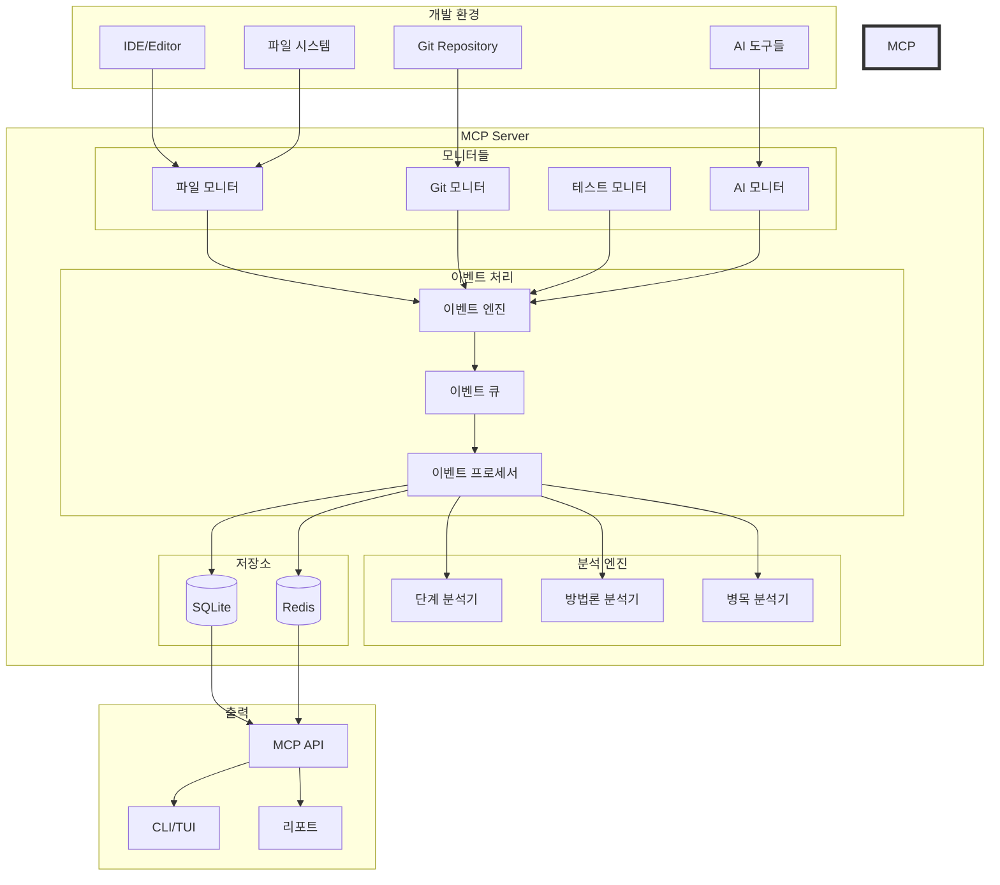

## 2. 데이터 처리 파이프라인

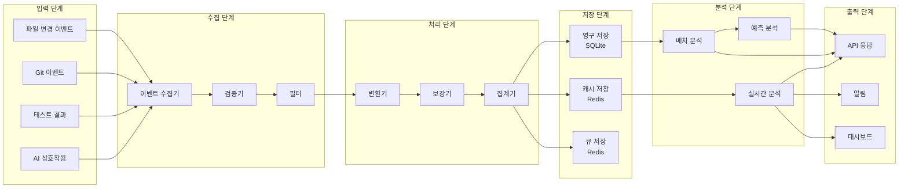

## 3. 파일 모니터링 플로우

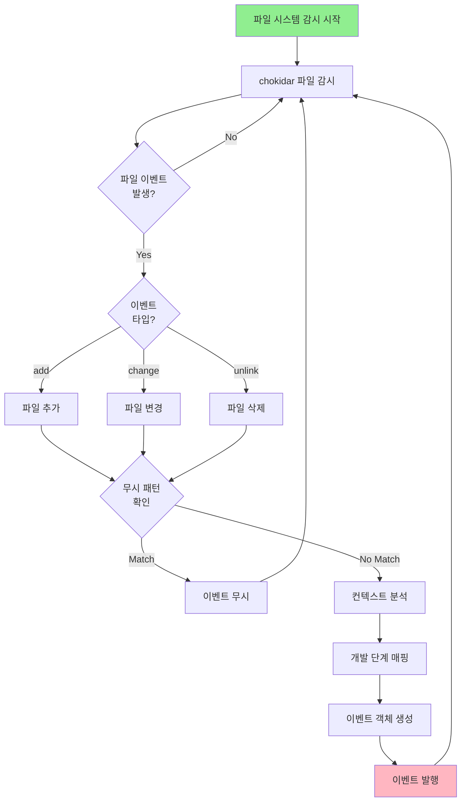

## 4. Git 활동 추적 플로우

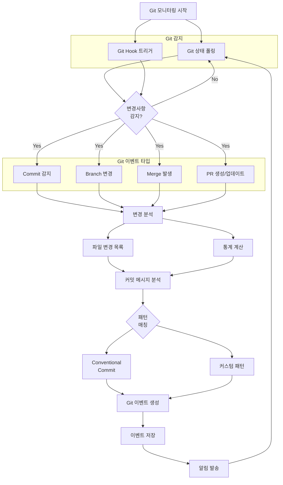

## 5. 개발 단계 인식 플로우

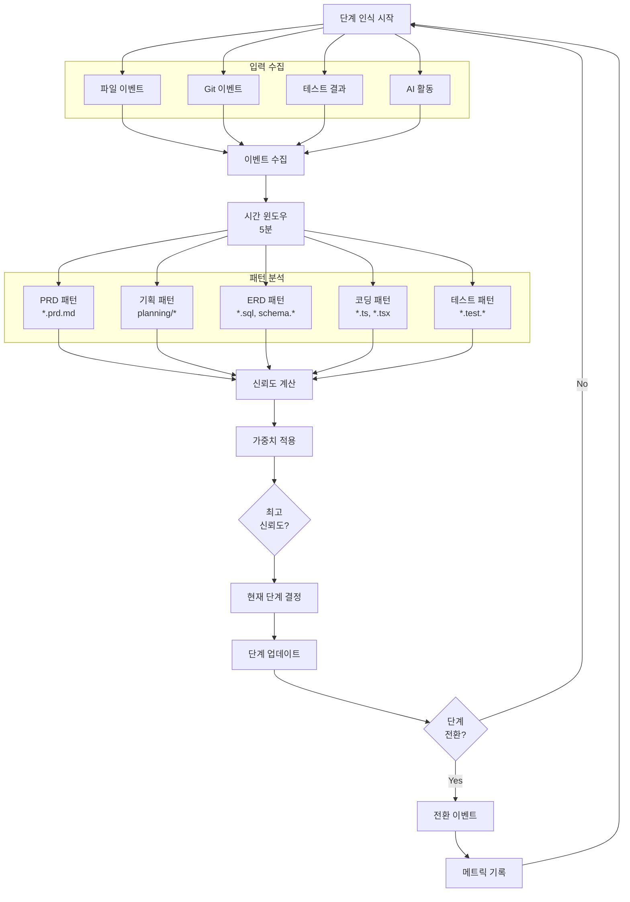

## 6. AI 협업 추적 플로우

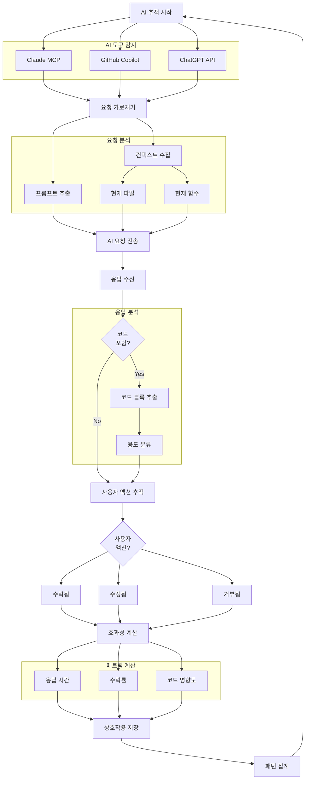

## 7. 방법론 모니터링 플로우

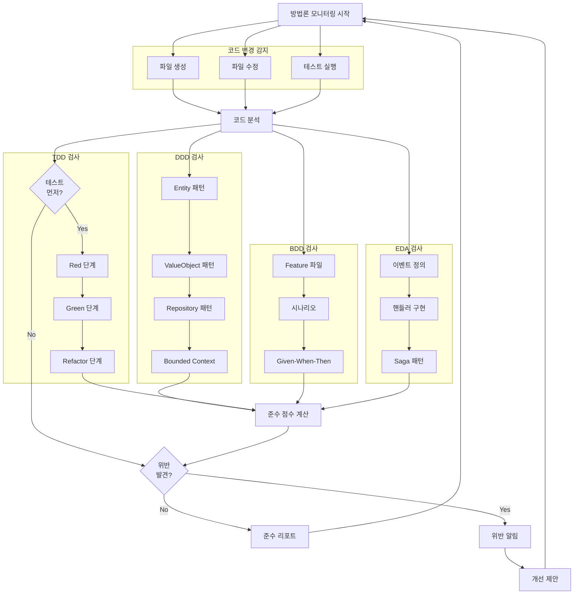

## 8. 병목 감지 플로우

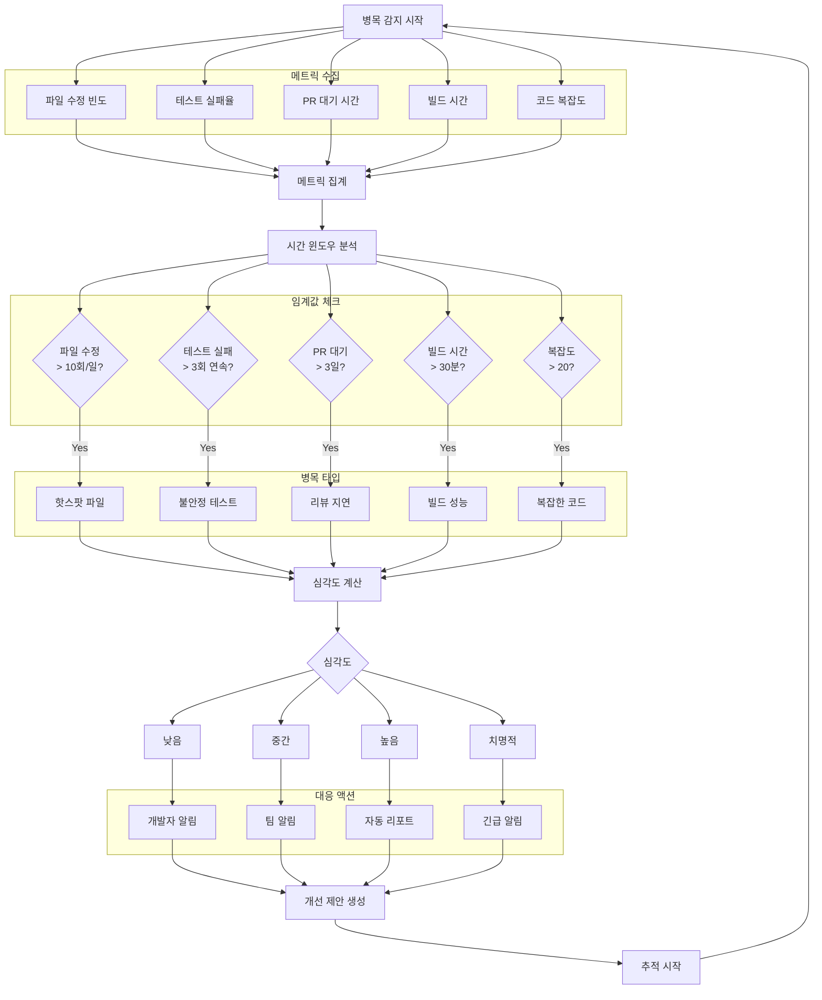

## 9. MCP 도구 처리 플로우

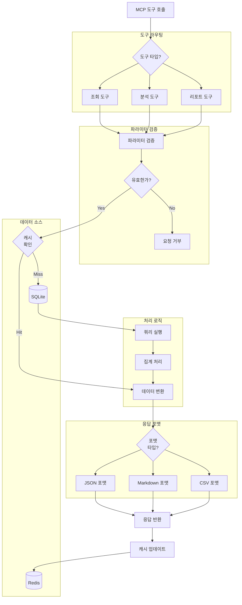

## 10. 시나리오: 새 기능 개발

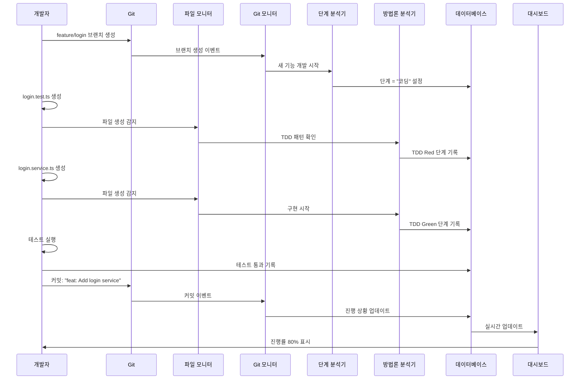

## 11. 시나리오: 버그 수정

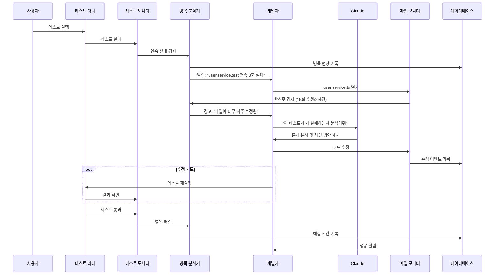

## 12. 시나리오: 코드 리뷰

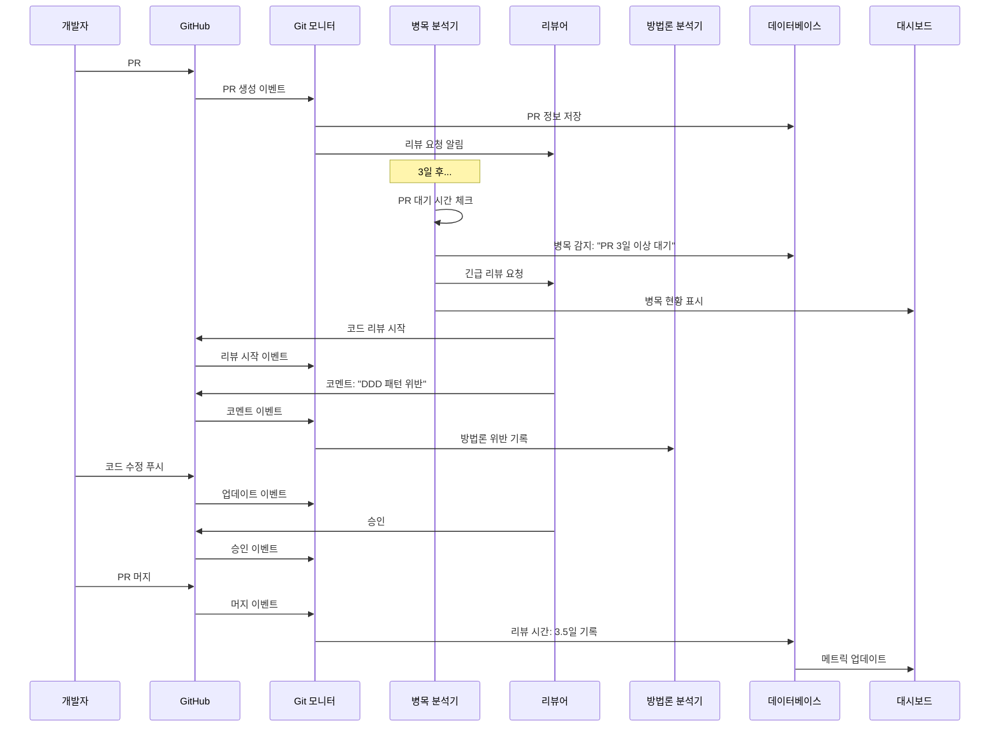

## 사용 가이드

### 플로우차트 읽는 방법

1. **도형 의미**
   - 사각형: 프로세스/액션
   - 마름모: 의사결정
   - 원통: 데이터 저장소
   - 평행사변형: 입출력

2. **화살표 의미**
   - 실선: 주요 흐름
   - 점선: 선택적 흐름
   - 굵은 선: 중요 경로

3. **색상 코딩**
   - 초록색: 시작점
   - 분홍색: 종료점
   - 노란색: 중요 프로세스

### 구현 시 참고사항

1. 각 플로우차트는 FEATURES.md의 상세 스펙과 연결됨
2. 시퀀스 다이어그램은 실제 구현 순서를 나타냄
3. 병목 지점은 특별히 모니터링 필요

이 플로우차트들은 시스템의 전체적인 동작을 이해하고 구현 시 참조하는 핵심 가이드입니다.

---

작성일: 2025-08-02  
최종 수정일: 2025-01-03  
작성자: yaioyaio