# DevFlow Monitor MCP - 시스템 플로우차트

## 목차
1. [전체 시스템 아키텍처 플로우](#1-전체-시스템-아키텍처-플로우)
2. [데이터 처리 파이프라인](#2-데이터-처리-파이프라인)
3. [파일 모니터링 플로우](#3-파일-모니터링-플로우)
4. [Git 활동 추적 플로우](#4-git-활동-추적-플로우)
5. [개발 단계 인식 플로우](#5-개발-단계-인식-플로우)
6. [AI 협업 추적 플로우](#6-ai-협업-추적-플로우)
7. [방법론 모니터링 플로우](#7-방법론-모니터링-플로우)
8. [병목 감지 플로우](#8-병목-감지-플로우)
9. [MCP 도구 처리 플로우](#9-mcp-도구-처리-플로우)
10. [시나리오: 새 기능 개발](#10-시나리오-새-기능-개발)
11. [시나리오: 버그 수정](#11-시나리오-버그-수정)
12. [시나리오: 코드 리뷰](#12-시나리오-코드-리뷰)

## 1. 전체 시스템 아키텍처 플로우

```mermaid
graph TB
    subgraph DEV["🖥️ 개발 환경"]
        IDE[IDE/Editor]:::input
        FS[파일 시스템]:::input
        GIT[Git Repository]:::input
        AI[AI 도구들]:::input
    end
    
    subgraph MCP["⚙️ MCP Server"]
        subgraph MON["📡 모니터들"]
            FM[파일 모니터]:::monitor
            GM[Git 모니터]:::monitor
            TM[테스트 모니터]:::monitor
            AM[AI 모니터]:::monitor
        end
        
        subgraph EVENT["⚡ 이벤트 처리"]
            EE[이벤트 엔진]:::engine
            EQ[이벤트 큐]:::queue
            EP[이벤트 프로세서]:::processor
        end
        
        subgraph ANALYSIS["🔍 분석 엔진"]
            SA[단계 분석기]:::analyzer
            MA[방법론 분석기]:::analyzer
            BA[병목 분석기]:::analyzer
        end
        
        subgraph STORAGE["💾 저장소"]
            SQL[(SQLite)]:::database
            CACHE[(인메모리 캐시)]:::cache
        end
    end
    
    subgraph OUTPUT["📊 출력"]
        API[MCP API]:::output
        CLI[CLI/TUI]:::output
        REPORT[리포트]:::output
    end
    
    %% 연결
    IDE -->|파일 변경| FM
    FS -->|이벤트| FM
    GIT -->|커밋/푸시| GM
    AI -->|AI 사용| AM
    
    FM -->|이벤트 발행| EE
    GM -->|이벤트 발행| EE
    TM -->|이벤트 발행| EE
    AM -->|이벤트 발행| EE
    
    EE -->|큐잉| EQ
    EQ -->|처리| EP
    
    EP -->|분석 요청| SA
    EP -->|분석 요청| MA
    EP -->|분석 요청| BA
    
    EP -->|저장| SQL
    EP -->|캐싱| CACHE
    
    SQL -->|데이터 제공| API
    CACHE -->|실시간 데이터| API
    
    API -->|렌더링| CLI
    API -->|생성| REPORT
    
    %% 스타일 정의
    classDef input fill:#e1f5fe,stroke:#01579b,stroke-width:2px,color:#01579b
    classDef monitor fill:#f3e5f5,stroke:#4a148c,stroke-width:2px,color:#4a148c
    classDef engine fill:#fff3e0,stroke:#e65100,stroke-width:2px,color:#e65100
    classDef queue fill:#fce4ec,stroke:#880e4f,stroke-width:2px,color:#880e4f
    classDef processor fill:#e8f5e9,stroke:#1b5e20,stroke-width:2px,color:#1b5e20
    classDef analyzer fill:#fffde7,stroke:#f57f17,stroke-width:2px,color:#f57f17
    classDef database fill:#e0f2f1,stroke:#004d40,stroke-width:2px,color:#004d40
    classDef cache fill:#ffebee,stroke:#b71c1c,stroke-width:2px,color:#b71c1c
    classDef output fill:#e8eaf6,stroke:#283593,stroke-width:2px,color:#283593
    classDef serverBox fill:#f5f5f5,stroke:#424242,stroke-width:3px
    
    class MCP serverBox
```

## 2. 데이터 처리 파이프라인

```mermaid
graph LR
    subgraph INPUT["📥 입력 단계"]
        E1[파일 변경 이벤트]:::event
        E2[Git 이벤트]:::event
        E3[테스트 결과]:::event
        E4[AI 상호작용]:::event
    end
    
    subgraph COLLECT["🔄 수집 단계"]
        C[이벤트 수집기]:::collector
        V[검증기]:::validator
        F[필터]:::filter
    end
    
    subgraph PROCESS["⚙️ 처리 단계"]
        T[변환기]:::transformer
        EN[보강기]:::enricher
        AG[집계기]:::aggregator
    end
    
    subgraph STORE["💾 저장 단계"]
        PS[영구 저장<br/>SQLite]:::database
        CS[캐시 저장<br/>인메모리]:::cache
        QS[큐 저장<br/>EventEmitter]:::queue
    end
    
    subgraph ANALYZE["📊 분석 단계"]
        RT[실시간 분석]:::realtime
        BA[배치 분석]:::batch
        PR[예측 분석]:::predict
    end
    
    subgraph OUT["📤 출력 단계"]
        API[API 응답]:::api
        ALERT[알림]:::alert
        DASH[대시보드]:::dashboard
    end
    
    E1 -->|수집| C
    E2 -->|수집| C
    E3 -->|수집| C
    E4 -->|수집| C
    
    C -->|검증| V
    V -->|필터링| F
    F -->|변환| T
    T -->|보강| EN
    EN -->|집계| AG
    
    AG -->|저장| PS
    AG -->|캐싱| CS
    AG -->|큐잉| QS
    
    CS -->|분석| RT
    PS -->|분석| BA
    BA -->|예측| PR
    
    RT -->|출력| API
    RT -->|알림| ALERT
    RT -->|표시| DASH
    BA -->|출력| API
    PR -->|출력| API
    
    %% 스타일 정의
    classDef event fill:#bbdefb,stroke:#1565c0,stroke-width:2px,color:#0d47a1
    classDef collector fill:#c8e6c9,stroke:#388e3c,stroke-width:2px,color:#1b5e20
    classDef validator fill:#ffccbc,stroke:#d84315,stroke-width:2px,color:#bf360c
    classDef filter fill:#d1c4e9,stroke:#512da8,stroke-width:2px,color:#311b92
    classDef transformer fill:#b2dfdb,stroke:#00796b,stroke-width:2px,color:#004d40
    classDef enricher fill:#f8bbd0,stroke:#c2185b,stroke-width:2px,color:#880e4f
    classDef aggregator fill:#c5cae9,stroke:#303f9f,stroke-width:2px,color:#1a237e
    classDef database fill:#b2ebf2,stroke:#0097a7,stroke-width:2px,color:#006064
    classDef cache fill:#ffccbc,stroke:#d84315,stroke-width:2px,color:#bf360c
    classDef queue fill:#d7ccc8,stroke:#5d4037,stroke-width:2px,color:#3e2723
    classDef realtime fill:#a5d6a7,stroke:#388e3c,stroke-width:2px,color:#1b5e20
    classDef batch fill:#90caf9,stroke:#1976d2,stroke-width:2px,color:#0d47a1
    classDef predict fill:#ce93d8,stroke:#7b1fa2,stroke-width:2px,color:#4a148c
    classDef api fill:#80cbc4,stroke:#00796b,stroke-width:2px,color:#004d40
    classDef alert fill:#ef9a9a,stroke:#c62828,stroke-width:2px,color:#b71c1c
    classDef dashboard fill:#80deea,stroke:#0097a7,stroke-width:2px,color:#006064
```

## 3. 파일 모니터링 플로우

```mermaid
flowchart TD
    START([시작]):::start
    
    WATCH[chokidar 파일 감시]:::process
    EVENT{파일 이벤트<br/>발생?}:::decision
    
    TYPE{이벤트<br/>타입?}:::decision
    ADD[파일 추가]:::action
    CHANGE[파일 변경]:::action
    DELETE[파일 삭제]:::action
    
    FILTER{무시 패턴<br/>확인}:::decision
    IGNORE[이벤트 무시]:::skip
    
    CONTEXT[컨텍스트 분석]:::analyze
    STAGE[개발 단계 매핑]:::analyze
    
    CREATE[이벤트 객체 생성]:::create
    EMIT[이벤트 발행]:::emit
    
    START --> WATCH
    WATCH --> EVENT
    EVENT -->|Yes| TYPE
    EVENT -->|No| WATCH
    
    TYPE -->|add| ADD
    TYPE -->|change| CHANGE
    TYPE -->|unlink| DELETE
    
    ADD --> FILTER
    CHANGE --> FILTER
    DELETE --> FILTER
    
    FILTER -->|Match| IGNORE
    FILTER -->|No Match| CONTEXT
    
    IGNORE --> WATCH
    
    CONTEXT --> STAGE
    STAGE --> CREATE
    CREATE --> EMIT
    EMIT --> WATCH
    
    %% 스타일 정의
    classDef start fill:#4caf50,stroke:#2e7d32,stroke-width:3px,color:#fff
    classDef process fill:#2196f3,stroke:#1565c0,stroke-width:2px,color:#fff
    classDef decision fill:#ff9800,stroke:#ef6c00,stroke-width:2px,color:#fff
    classDef action fill:#9c27b0,stroke:#6a1b9a,stroke-width:2px,color:#fff
    classDef skip fill:#9e9e9e,stroke:#616161,stroke-width:2px,color:#fff
    classDef analyze fill:#00bcd4,stroke:#0097a7,stroke-width:2px,color:#fff
    classDef create fill:#3f51b5,stroke:#283593,stroke-width:2px,color:#fff
    classDef emit fill:#f44336,stroke:#c62828,stroke-width:2px,color:#fff
```

## 4. Git 활동 추적 플로우

```mermaid
flowchart TD
    START([Git 모니터링 시작]):::start
    
    subgraph DETECT["🔍 Git 감지"]
        POLL[Git 상태 폴링]:::monitor
        HOOK[Git Hook 트리거]:::monitor
    end
    
    DETECTED{변경사항<br/>감지?}:::decision
    
    subgraph EVENTS["📝 Git 이벤트 타입"]
        COMMIT[Commit 감지]:::git
        BRANCH[Branch 변경]:::git
        MERGE[Merge 발생]:::git
        PR[PR 생성/업데이트]:::git
    end
    
    ANALYZE[변경 분석]:::analyze
    FILES[파일 변경 목록]:::data
    STATS[통계 계산]:::data
    
    MESSAGE[커밋 메시지 분석]:::analyze
    PATTERN{패턴<br/>매칭}:::decision
    
    CONVENTIONAL[Conventional<br/>Commit]:::pattern
    CUSTOM[커스텀 패턴]:::pattern
    
    BUILD[Git 이벤트 생성]:::create
    STORE[이벤트 저장]:::store
    NOTIFY[알림 발송]:::notify
    
    START --> POLL
    START --> HOOK
    POLL --> DETECTED
    HOOK --> DETECTED
    
    DETECTED -->|Yes| COMMIT
    DETECTED -->|Yes| BRANCH
    DETECTED -->|Yes| MERGE
    DETECTED -->|Yes| PR
    DETECTED -->|No| POLL
    
    COMMIT --> ANALYZE
    BRANCH --> ANALYZE
    MERGE --> ANALYZE
    PR --> ANALYZE
    
    ANALYZE --> FILES
    ANALYZE --> STATS
    FILES --> MESSAGE
    STATS --> MESSAGE
    
    MESSAGE --> PATTERN
    PATTERN --> CONVENTIONAL
    PATTERN --> CUSTOM
    
    CONVENTIONAL --> BUILD
    CUSTOM --> BUILD
    
    BUILD --> STORE
    STORE --> NOTIFY
    NOTIFY --> POLL
    
    %% 스타일 정의
    classDef start fill:#4caf50,stroke:#2e7d32,stroke-width:3px,color:#fff
    classDef monitor fill:#9c27b0,stroke:#6a1b9a,stroke-width:2px,color:#fff
    classDef decision fill:#ff9800,stroke:#ef6c00,stroke-width:2px,color:#fff
    classDef git fill:#f44336,stroke:#c62828,stroke-width:2px,color:#fff
    classDef analyze fill:#2196f3,stroke:#1565c0,stroke-width:2px,color:#fff
    classDef data fill:#00bcd4,stroke:#0097a7,stroke-width:2px,color:#fff
    classDef pattern fill:#3f51b5,stroke:#283593,stroke-width:2px,color:#fff
    classDef create fill:#009688,stroke:#00695c,stroke-width:2px,color:#fff
    classDef store fill:#795548,stroke:#4e342e,stroke-width:2px,color:#fff
    classDef notify fill:#ff5722,stroke:#d84315,stroke-width:2px,color:#fff
```

## 5. 개발 단계 인식 플로우

```mermaid
flowchart TD
    START([단계 인식 시작]):::start
    
    subgraph INPUTS["📥 입력 수집"]
        FILE[파일 이벤트]:::input
        GIT[Git 이벤트]:::input
        TEST[테스트 결과]:::input
        AI[AI 활동]:::input
    end
    
    COLLECT[이벤트 수집]:::process
    WINDOW[시간 윈도우<br/>5분]:::timer
    
    subgraph PATTERNS["🔍 패턴 분석"]
        P1[PRD 패턴<br/>*.prd.md]:::pattern
        P2[기획 패턴<br/>planning/*]:::pattern
        P3[ERD 패턴<br/>*.sql, schema.*]:::pattern
        P4[코딩 패턴<br/>*.ts, *.tsx]:::pattern
        P5[테스트 패턴<br/>*.test.*]:::pattern
    end
    
    CALC[신뢰도 계산]:::calculate
    WEIGHT[가중치 적용]:::calculate
    
    COMPARE{최고<br/>신뢰도?}:::decision
    
    CURRENT[현재 단계 결정]:::determine
    UPDATE[단계 업데이트]:::update
    
    TRANSITION{단계<br/>전환?}:::decision
    EVENT[전환 이벤트]:::event
    METRIC[메트릭 기록]:::record
    
    START --> FILE
    START --> GIT
    START --> TEST
    START --> AI
    
    FILE --> COLLECT
    GIT --> COLLECT
    TEST --> COLLECT
    AI --> COLLECT
    
    COLLECT --> WINDOW
    WINDOW --> P1
    WINDOW --> P2
    WINDOW --> P3
    WINDOW --> P4
    WINDOW --> P5
    
    P1 --> CALC
    P2 --> CALC
    P3 --> CALC
    P4 --> CALC
    P5 --> CALC
    
    CALC --> WEIGHT
    WEIGHT --> COMPARE
    COMPARE --> CURRENT
    CURRENT --> UPDATE
    
    UPDATE --> TRANSITION
    TRANSITION -->|Yes| EVENT
    TRANSITION -->|No| START
    EVENT --> METRIC
    METRIC --> START
    
    %% 스타일 정의
    classDef start fill:#4caf50,stroke:#2e7d32,stroke-width:3px,color:#fff
    classDef input fill:#e91e63,stroke:#c2185b,stroke-width:2px,color:#fff
    classDef process fill:#2196f3,stroke:#1565c0,stroke-width:2px,color:#fff
    classDef timer fill:#ff9800,stroke:#ef6c00,stroke-width:2px,color:#fff
    classDef pattern fill:#9c27b0,stroke:#6a1b9a,stroke-width:2px,color:#fff
    classDef calculate fill:#00bcd4,stroke:#0097a7,stroke-width:2px,color:#fff
    classDef decision fill:#ffc107,stroke:#f57c00,stroke-width:2px,color:#000
    classDef determine fill:#3f51b5,stroke:#283593,stroke-width:2px,color:#fff
    classDef update fill:#009688,stroke:#00695c,stroke-width:2px,color:#fff
    classDef event fill:#f44336,stroke:#c62828,stroke-width:2px,color:#fff
    classDef record fill:#795548,stroke:#4e342e,stroke-width:2px,color:#fff
```

## 6. AI 협업 추적 플로우

```mermaid
flowchart TD
    START([AI 추적 시작]):::start
    
    subgraph TOOLS["🤖 AI 도구 감지"]
        CLAUDE[Claude MCP]:::ai
        COPILOT[GitHub Copilot]:::ai
        CHATGPT[ChatGPT API]:::ai
    end
    
    INTERCEPT[요청 가로채기]:::intercept
    
    subgraph REQUEST["📝 요청 분석"]
        PROMPT[프롬프트 추출]:::extract
        CONTEXT[컨텍스트 수집]:::extract
        FILE[현재 파일]:::context
        FUNC[현재 함수]:::context
    end
    
    SEND[AI 요청 전송]:::send
    RESPONSE[응답 수신]:::receive
    
    subgraph RESP_ANALYSIS["🔍 응답 분석"]
        CODE{코드<br/>포함?}:::decision
        EXTRACT[코드 블록 추출]:::extract
        PURPOSE[용도 분류]:::classify
    end
    
    TRACK[사용자 액션 추적]:::track
    
    ACTION{사용자<br/>액션?}:::decision
    ACCEPT[수락됨]:::accept
    MODIFY[수정됨]:::modify
    REJECT[거부됨]:::reject
    
    CALC[효과성 계산]:::calculate
    
    subgraph METRICS["📊 메트릭 계산"]
        TIME[응답 시간]:::metric
        RATE[수락률]:::metric
        IMPACT[코드 영향도]:::metric
    end
    
    STORE[상호작용 저장]:::store
    AGGREGATE[패턴 집계]:::aggregate
    
    START --> CLAUDE
    START --> COPILOT
    START --> CHATGPT
    
    CLAUDE --> INTERCEPT
    COPILOT --> INTERCEPT
    CHATGPT --> INTERCEPT
    
    INTERCEPT --> PROMPT
    INTERCEPT --> CONTEXT
    CONTEXT --> FILE
    CONTEXT --> FUNC
    
    PROMPT --> SEND
    FILE --> SEND
    FUNC --> SEND
    
    SEND --> RESPONSE
    RESPONSE --> CODE
    
    CODE -->|Yes| EXTRACT
    CODE -->|No| TRACK
    EXTRACT --> PURPOSE
    PURPOSE --> TRACK
    
    TRACK --> ACTION
    ACTION --> ACCEPT
    ACTION --> MODIFY
    ACTION --> REJECT
    
    ACCEPT --> CALC
    MODIFY --> CALC
    REJECT --> CALC
    
    CALC --> TIME
    CALC --> RATE
    CALC --> IMPACT
    
    TIME --> STORE
    RATE --> STORE
    IMPACT --> STORE
    
    STORE --> AGGREGATE
    AGGREGATE --> START
    
    %% 스타일 정의
    classDef start fill:#4caf50,stroke:#2e7d32,stroke-width:3px,color:#fff
    classDef ai fill:#673ab7,stroke:#4527a0,stroke-width:2px,color:#fff
    classDef intercept fill:#ff5722,stroke:#d84315,stroke-width:2px,color:#fff
    classDef extract fill:#2196f3,stroke:#1565c0,stroke-width:2px,color:#fff
    classDef context fill:#00bcd4,stroke:#0097a7,stroke-width:2px,color:#fff
    classDef send fill:#4caf50,stroke:#2e7d32,stroke-width:2px,color:#fff
    classDef receive fill:#ff9800,stroke:#ef6c00,stroke-width:2px,color:#fff
    classDef decision fill:#ffc107,stroke:#f57c00,stroke-width:2px,color:#000
    classDef classify fill:#9c27b0,stroke:#6a1b9a,stroke-width:2px,color:#fff
    classDef track fill:#3f51b5,stroke:#283593,stroke-width:2px,color:#fff
    classDef accept fill:#4caf50,stroke:#2e7d32,stroke-width:2px,color:#fff
    classDef modify fill:#ff9800,stroke:#ef6c00,stroke-width:2px,color:#fff
    classDef reject fill:#f44336,stroke:#c62828,stroke-width:2px,color:#fff
    classDef calculate fill:#009688,stroke:#00695c,stroke-width:2px,color:#fff
    classDef metric fill:#795548,stroke:#4e342e,stroke-width:2px,color:#fff
    classDef store fill:#607d8b,stroke:#37474f,stroke-width:2px,color:#fff
    classDef aggregate fill:#e91e63,stroke:#c2185b,stroke-width:2px,color:#fff
```

## 7. 방법론 모니터링 플로우

```mermaid
flowchart TD
    START([방법론 모니터링 시작]):::start
    
    subgraph CHANGES["📝 코드 변경 감지"]
        CREATE[파일 생성]:::change
        MODIFY[파일 수정]:::change
        TEST[테스트 실행]:::change
    end
    
    ANALYZE[코드 분석]:::analyze
    
    subgraph DDD["🏛️ DDD 검사"]
        DDD_E[Entity 패턴]:::ddd
        DDD_V[ValueObject 패턴]:::ddd
        DDD_R[Repository 패턴]:::ddd
        DDD_B[Bounded Context]:::ddd
    end
    
    subgraph TDD["🔴 TDD 검사"]
        TDD_T{테스트<br/>먼저?}:::decision
        TDD_R[Red 단계]:::tdd
        TDD_G[Green 단계]:::tdd
        TDD_RF[Refactor 단계]:::tdd
    end
    
    subgraph BDD["📋 BDD 검사"]
        BDD_F[Feature 파일]:::bdd
        BDD_S[시나리오]:::bdd
        BDD_GWT[Given-When-Then]:::bdd
    end
    
    subgraph EDA["⚡ EDA 검사"]
        EDA_E[이벤트 정의]:::eda
        EDA_H[핸들러 구현]:::eda
        EDA_S[Saga 패턴]:::eda
    end
    
    SCORE[준수 점수 계산]:::calculate
    VIOLATION{위반<br/>발견?}:::decision
    
    REPORT[준수 리포트]:::report
    SUGGEST[개선 제안]:::suggest
    ALERT[위반 알림]:::alert
    
    START --> CREATE
    START --> MODIFY
    START --> TEST
    
    CREATE --> ANALYZE
    MODIFY --> ANALYZE
    TEST --> ANALYZE
    
    ANALYZE --> DDD_E
    ANALYZE --> TDD_T
    ANALYZE --> BDD_F
    ANALYZE --> EDA_E
    
    DDD_E --> DDD_V
    DDD_V --> DDD_R
    DDD_R --> DDD_B
    
    TDD_T -->|Yes| TDD_R
    TDD_T -->|No| VIOLATION
    TDD_R --> TDD_G
    TDD_G --> TDD_RF
    
    BDD_F --> BDD_S
    BDD_S --> BDD_GWT
    
    EDA_E --> EDA_H
    EDA_H --> EDA_S
    
    DDD_B --> SCORE
    TDD_RF --> SCORE
    BDD_GWT --> SCORE
    EDA_S --> SCORE
    
    SCORE --> VIOLATION
    VIOLATION -->|Yes| ALERT
    VIOLATION -->|No| REPORT
    ALERT --> SUGGEST
    
    REPORT --> START
    SUGGEST --> START
    
    %% 스타일 정의
    classDef start fill:#4caf50,stroke:#2e7d32,stroke-width:3px,color:#fff
    classDef change fill:#2196f3,stroke:#1565c0,stroke-width:2px,color:#fff
    classDef analyze fill:#ff9800,stroke:#ef6c00,stroke-width:2px,color:#fff
    classDef ddd fill:#9c27b0,stroke:#6a1b9a,stroke-width:2px,color:#fff
    classDef tdd fill:#f44336,stroke:#c62828,stroke-width:2px,color:#fff
    classDef bdd fill:#3f51b5,stroke:#283593,stroke-width:2px,color:#fff
    classDef eda fill:#00bcd4,stroke:#0097a7,stroke-width:2px,color:#fff
    classDef decision fill:#ffc107,stroke:#f57c00,stroke-width:2px,color:#000
    classDef calculate fill:#009688,stroke:#00695c,stroke-width:2px,color:#fff
    classDef report fill:#4caf50,stroke:#2e7d32,stroke-width:2px,color:#fff
    classDef suggest fill:#ff9800,stroke:#ef6c00,stroke-width:2px,color:#fff
    classDef alert fill:#f44336,stroke:#c62828,stroke-width:2px,color:#fff
```

## 8. 병목 감지 플로우

```mermaid
flowchart TD
    START([병목 감지 시작]):::start
    
    subgraph METRICS["📊 메트릭 수집"]
        M1[파일 수정 빈도]:::metric
        M2[테스트 실패율]:::metric
        M3[PR 대기 시간]:::metric
        M4[빌드 시간]:::metric
        M5[코드 복잡도]:::metric
    end
    
    COLLECT[메트릭 집계]:::process
    WINDOW[시간 윈도우 분석]:::analyze
    
    subgraph THRESHOLDS["⚠️ 임계값 체크"]
        T1{파일 수정<br/>> 10회/일?}:::threshold
        T2{테스트 실패<br/>> 3회 연속?}:::threshold
        T3{PR 대기<br/>> 3일?}:::threshold
        T4{빌드 시간<br/>> 30분?}:::threshold
        T5{복잡도<br/>> 20?}:::threshold
    end
    
    subgraph BOTTLENECKS["🚧 병목 타입"]
        B1[핫스팟 파일]:::bottleneck
        B2[불안정 테스트]:::bottleneck
        B3[리뷰 지연]:::bottleneck
        B4[빌드 성능]:::bottleneck
        B5[복잡한 코드]:::bottleneck
    end
    
    SEVERITY[심각도 계산]:::calculate
    
    SEV{심각도}:::decision
    LOW[낮음]:::low
    MED[중간]:::medium
    HIGH[높음]:::high
    CRIT[치명적]:::critical
    
    subgraph ACTIONS["🔔 대응 액션"]
        A1[개발자 알림]:::action
        A2[팀 알림]:::action
        A3[자동 리포트]:::action
        A4[긴급 알림]:::action
    end
    
    SUGGEST[개선 제안 생성]:::suggest
    TRACK[추적 시작]:::track
    
    START --> M1
    START --> M2
    START --> M3
    START --> M4
    START --> M5
    
    M1 --> COLLECT
    M2 --> COLLECT
    M3 --> COLLECT
    M4 --> COLLECT
    M5 --> COLLECT
    
    COLLECT --> WINDOW
    
    WINDOW --> T1
    WINDOW --> T2
    WINDOW --> T3
    WINDOW --> T4
    WINDOW --> T5
    
    T1 -->|Yes| B1
    T2 -->|Yes| B2
    T3 -->|Yes| B3
    T4 -->|Yes| B4
    T5 -->|Yes| B5
    
    B1 --> SEVERITY
    B2 --> SEVERITY
    B3 --> SEVERITY
    B4 --> SEVERITY
    B5 --> SEVERITY
    
    SEVERITY --> SEV
    
    SEV --> LOW
    SEV --> MED
    SEV --> HIGH
    SEV --> CRIT
    
    LOW --> A1
    MED --> A2
    HIGH --> A3
    CRIT --> A4
    
    A1 --> SUGGEST
    A2 --> SUGGEST
    A3 --> SUGGEST
    A4 --> SUGGEST
    
    SUGGEST --> TRACK
    TRACK --> START
    
    %% 스타일 정의
    classDef start fill:#4caf50,stroke:#2e7d32,stroke-width:3px,color:#fff
    classDef metric fill:#2196f3,stroke:#1565c0,stroke-width:2px,color:#fff
    classDef process fill:#673ab7,stroke:#4527a0,stroke-width:2px,color:#fff
    classDef analyze fill:#ff9800,stroke:#ef6c00,stroke-width:2px,color:#fff
    classDef threshold fill:#ffc107,stroke:#f57c00,stroke-width:2px,color:#000
    classDef bottleneck fill:#f44336,stroke:#c62828,stroke-width:2px,color:#fff
    classDef calculate fill:#795548,stroke:#4e342e,stroke-width:2px,color:#fff
    classDef decision fill:#9e9e9e,stroke:#616161,stroke-width:2px,color:#fff
    classDef low fill:#4caf50,stroke:#2e7d32,stroke-width:2px,color:#fff
    classDef medium fill:#ff9800,stroke:#ef6c00,stroke-width:2px,color:#fff
    classDef high fill:#ff5722,stroke:#d84315,stroke-width:2px,color:#fff
    classDef critical fill:#f44336,stroke:#c62828,stroke-width:3px,color:#fff
    classDef action fill:#3f51b5,stroke:#283593,stroke-width:2px,color:#fff
    classDef suggest fill:#00bcd4,stroke:#0097a7,stroke-width:2px,color:#fff
    classDef track fill:#009688,stroke:#00695c,stroke-width:2px,color:#fff
```

## 9. MCP 도구 처리 플로우

```mermaid
flowchart TD
    START([MCP 도구 호출]):::start
    
    subgraph ROUTING["🔀 도구 라우팅"]
        TOOL{도구 타입?}:::decision
        GET[조회 도구]:::tool
        ANALYZE[분석 도구]:::tool
        REPORT[리포트 도구]:::tool
    end
    
    subgraph VALIDATION["✅ 파라미터 검증"]
        VALIDATE[파라미터 검증]:::validate
        ERROR1{유효한가?}:::decision
        REJECT[요청 거부]:::reject
    end
    
    subgraph DATASOURCE["💾 데이터 소스"]
        CACHE{캐시<br/>확인}:::decision
        CACHE[(인메모리 캐시)]:::cache
        SQLITE[(SQLite)]:::database
    end
    
    subgraph PROCESSING["⚙️ 처리 로직"]
        QUERY[쿼리 실행]:::process
        TRANSFORM[데이터 변환]:::process
        AGGREGATE[집계 처리]:::process
    end
    
    subgraph FORMATTING["📄 응답 포맷"]
        FORMAT{포맷<br/>타입?}:::decision
        JSON[JSON 포맷]:::format
        MD[Markdown 포맷]:::format
        CSV[CSV 포맷]:::format
    end
    
    RESPONSE[응답 반환]:::response
    UPDATE[캐시 업데이트]:::update
    
    START --> TOOL
    
    TOOL --> GET
    TOOL --> ANALYZE
    TOOL --> REPORT
    
    GET --> VALIDATE
    ANALYZE --> VALIDATE
    REPORT --> VALIDATE
    
    VALIDATE --> ERROR1
    ERROR1 -->|No| REJECT
    ERROR1 -->|Yes| CACHE
    
    CACHE -->|Hit| TRANSFORM
    CACHE -->|Miss| SQLITE
    
    SQLITE --> QUERY
    QUERY --> AGGREGATE
    AGGREGATE --> TRANSFORM
    
    TRANSFORM --> FORMAT
    
    FORMAT --> JSON
    FORMAT --> MD
    FORMAT --> CSV
    
    JSON --> RESPONSE
    MD --> RESPONSE
    CSV --> RESPONSE
    
    RESPONSE --> UPDATE
    UPDATE --> CACHE
    
    %% 스타일 정의
    classDef start fill:#4caf50,stroke:#2e7d32,stroke-width:3px,color:#fff
    classDef decision fill:#ffc107,stroke:#f57c00,stroke-width:2px,color:#000
    classDef tool fill:#2196f3,stroke:#1565c0,stroke-width:2px,color:#fff
    classDef validate fill:#9c27b0,stroke:#6a1b9a,stroke-width:2px,color:#fff
    classDef reject fill:#f44336,stroke:#c62828,stroke-width:2px,color:#fff
    classDef cache fill:#ff9800,stroke:#ef6c00,stroke-width:2px,color:#fff
    classDef database fill:#00bcd4,stroke:#0097a7,stroke-width:2px,color:#fff
    classDef process fill:#3f51b5,stroke:#283593,stroke-width:2px,color:#fff
    classDef format fill:#009688,stroke:#00695c,stroke-width:2px,color:#fff
    classDef response fill:#4caf50,stroke:#2e7d32,stroke-width:2px,color:#fff
    classDef update fill:#795548,stroke:#4e342e,stroke-width:2px,color:#fff
```

## 10. 시나리오: 새 기능 개발

```mermaid
sequenceDiagram
    participant DEV as 👨‍💻 개발자
    participant GIT as 📦 Git
    participant FM as 📁 파일 모니터
    participant GM as 🔍 Git 모니터
    participant SA as 📊 단계 분석기
    participant MA as 📐 방법론 분석기
    participant DB as 💾 데이터베이스
    participant DASH as 📊 대시보드
    
    rect rgb(240, 248, 255)
        note over DEV,DASH: 🚀 새 기능 개발 시작
    end
    
    DEV->>GIT: feature/login 브랜치 생성
    activate GIT
    GIT->>GM: 브랜치 생성 이벤트
    deactivate GIT
    activate GM
    GM->>SA: 새 기능 개발 시작
    deactivate GM
    activate SA
    SA->>DB: 단계 = "코딩" 설정
    deactivate SA
    
    rect rgb(255, 240, 245)
        note over DEV,MA: 🔴 TDD Red 단계
    end
    
    DEV->>DEV: login.test.ts 생성
    activate FM
    DEV->>FM: 파일 생성 감지
    FM->>MA: TDD 패턴 확인
    deactivate FM
    activate MA
    MA->>DB: TDD Red 단계 기록
    deactivate MA
    
    rect rgb(240, 255, 240)
        note over DEV,MA: 🟢 TDD Green 단계
    end
    
    DEV->>DEV: login.service.ts 생성
    activate FM
    DEV->>FM: 파일 생성 감지
    FM->>MA: 구현 시작
    deactivate FM
    activate MA
    MA->>DB: TDD Green 단계 기록
    deactivate MA
    
    DEV->>DEV: 테스트 실행
    DEV->>DB: 테스트 통과 기록
    
    rect rgb(255, 253, 231)
        note over DEV,DASH: 📝 커밋 및 진행 상황 업데이트
    end
    
    DEV->>GIT: 커밋: "feat: Add login service"
    activate GIT
    GIT->>GM: 커밋 이벤트
    deactivate GIT
    activate GM
    GM->>DB: 진행 상황 업데이트
    deactivate GM
    
    activate DB
    DB->>DASH: 실시간 업데이트
    deactivate DB
    activate DASH
    DASH->>DEV: 진행률 80% 표시
    deactivate DASH
```

## 11. 시나리오: 버그 수정

```mermaid
sequenceDiagram
    participant USER as 👤 사용자
    participant TEST as 🧪 테스트 러너
    participant TM as 📊 테스트 모니터
    participant BA as ⚠️ 병목 분석기
    participant DEV as 👨‍💻 개발자
    participant AI as 🤖 Claude
    participant FM as 📁 파일 모니터
    participant DB as 💾 데이터베이스
    
    rect rgb(255, 240, 240)
        note over USER,BA: 🐛 버그 발견
    end
    
    USER->>TEST: 테스트 실행
    activate TEST
    TEST->>TM: 테스트 실패
    deactivate TEST
    activate TM
    TM->>BA: 연속 실패 감지
    deactivate TM
    activate BA
    BA->>DB: 병목 현상 기록
    BA->>DEV: 알림: "user.service.test 연속 3회 실패"
    deactivate BA
    
    rect rgb(255, 255, 240)
        note over DEV,BA: ⚠️ 핫스팟 감지
    end
    
    DEV->>FM: user.service.ts 열기
    activate FM
    FM->>BA: 핫스팟 감지 (15회 수정/2시간)
    deactivate FM
    activate BA
    BA->>DEV: 경고: "파일이 너무 자주 수정됨"
    deactivate BA
    
    rect rgb(240, 248, 255)
        note over DEV,AI: 🤖 AI 지원
    end
    
    DEV->>AI: "이 테스트가 왜 실패하는지 분석해줘"
    activate AI
    AI->>DEV: 문제 분석 및 해결 방안 제시
    deactivate AI
    
    DEV->>FM: 코드 수정
    activate FM
    FM->>DB: 수정 이벤트 기록
    deactivate FM
    
    rect rgb(240, 255, 240)
        note over DEV,DB: ✅ 문제 해결
    end
    
    loop 수정 시도
        DEV->>TEST: 테스트 재실행
        activate TEST
        TEST->>TM: 결과 확인
        deactivate TEST
    end
    
    TEST->>TM: 테스트 통과
    activate TM
    TM->>BA: 병목 해결
    deactivate TM
    activate BA
    BA->>DB: 해결 시간 기록
    deactivate BA
    activate DB
    DB->>DEV: 성공 알림
    deactivate DB
```

## 12. 시나리오: 코드 리뷰

```mermaid
sequenceDiagram
    participant DEV as 👨‍💻 개발자
    participant GIT as 📦 GitHub
    participant GM as 🔍 Git 모니터
    participant BA as ⚠️ 병목 분석기
    participant REV as 👥 리뷰어
    participant MA as 📐 방법론 분석기
    participant DB as 💾 데이터베이스
    participant DASH as 📊 대시보드
    
    rect rgb(240, 248, 255)
        note over DEV,REV: 📝 PR 생성
    end
    
    DEV->>GIT: PR #123 생성
    activate GIT
    GIT->>GM: PR 생성 이벤트
    deactivate GIT
    activate GM
    GM->>DB: PR 정보 저장
    GM->>REV: 리뷰 요청 알림
    deactivate GM
    
    rect rgb(255, 255, 240)
        note over BA,DASH: ⏰ 3일 후...
    end
    
    Note over BA: 3일 후...
    
    activate BA
    BA->>BA: PR 대기 시간 체크
    BA->>DB: 병목 감지: "PR 3일 이상 대기"
    BA->>REV: 긴급 리뷰 요청
    BA->>DASH: 병목 현황 표시
    deactivate BA
    
    rect rgb(255, 240, 245)
        note over REV,MA: 👀 코드 리뷰
    end
    
    REV->>GIT: 코드 리뷰 시작
    activate GIT
    GIT->>GM: 리뷰 시작 이벤트
    deactivate GIT
    
    REV->>GIT: 코멘트: "DDD 패턴 위반"
    activate GIT
    GIT->>GM: 코멘트 이벤트
    deactivate GIT
    activate GM
    GM->>MA: 방법론 위반 기록
    deactivate GM
    
    DEV->>GIT: 코드 수정 푸시
    activate GIT
    GIT->>GM: 업데이트 이벤트
    deactivate GIT
    
    rect rgb(240, 255, 240)
        note over REV,DASH: ✅ 승인 및 머지
    end
    
    REV->>GIT: 승인
    activate GIT
    GIT->>GM: 승인 이벤트
    deactivate GIT
    
    DEV->>GIT: PR 머지
    activate GIT
    GIT->>GM: 머지 이벤트
    deactivate GIT
    activate GM
    GM->>DB: 리뷰 시간: 3.5일 기록
    deactivate GM
    activate DB
    DB->>DASH: 메트릭 업데이트
    deactivate DB
```

## 사용 가이드

### 플로우차트 읽는 방법

1. **도형 의미**
   - 🟩 **둥근 사각형**: 시작/종료점
   - 🟦 **사각형**: 프로세스/액션
   - 🟨 **마름모**: 의사결정
   - 🟪 **원통**: 데이터 저장소
   - 🟧 **평행사변형**: 입출력

2. **색상 의미**
   - 🟢 **초록색**: 시작점, 성공, 정상 상태
   - 🔴 **빨간색**: 종료점, 오류, 위험 상태
   - 🟡 **노란색**: 주의, 결정 필요
   - 🔵 **파란색**: 처리 중, 정보
   - 🟣 **보라색**: 특별한 프로세스

3. **화살표 의미**
   - ➡️ **실선**: 주요 흐름
   - ⚊⚊ **점선**: 선택적 흐름
   - **굵은 선**: 중요 경로

### 구현 시 참고사항

1. 각 플로우차트는 FEATURES.md의 상세 스펙과 연결됨
2. 시퀀스 다이어그램은 실제 구현 순서를 나타냄
3. 병목 지점은 특별히 모니터링 필요

이 플로우차트들은 시스템의 전체적인 동작을 이해하고 구현 시 참조하는 핵심 가이드입니다.

---

작성일: 2025-08-02  
최종 수정일: 2025-01-03  
작성자: yaioyaio