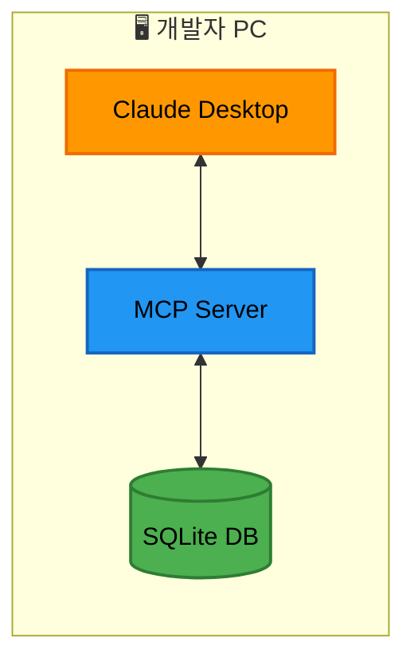
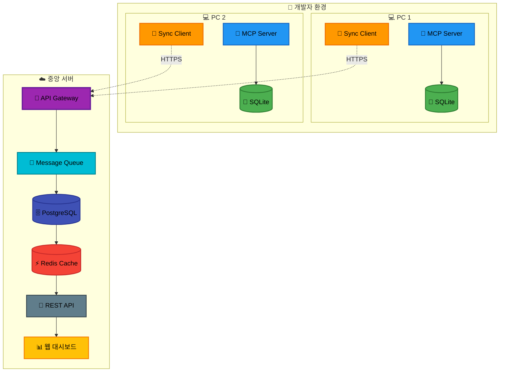

# DevFlow Monitor MCP - 원격 중앙 모니터링 통합 전략

## 1. 개요

### 1.1 배경

DevFlow Monitor MCP는 개발자의 로컬 환경에서 실행되는 개발 프로세스 모니터링 도구로 시작했습니다. 하지만 팀 차원의 프로젝트 관리와 전체적인 개발 현황 파악을 위해서는 중앙 집중식 모니터링이 필요합니다.

### 1.2 로컬 우선 아키텍처의 장점

- **오프라인 작업**: 네트워크 연결 없이도 정상 작동
- **빠른 응답 속도**: 로컬 SQLite 기반으로 밀리초 단위 응답
- **데이터 소유권**: 개발자가 자신의 데이터를 완전히 통제
- **프라이버시**: 민감한 코드 정보가 로컬에만 보관

### 1.3 중앙 모니터링의 필요성

- **팀 대시보드**: 프로젝트 관리자의 전체 현황 파악
- **통합 리포트**: 여러 개발자의 활동 집계
- **병목 현상 조기 감지**: 팀 레벨의 패턴 분석
- **리소스 최적화**: 팀원 간 업무 분배 개선

### 1.4 통합 접근 방식

로컬 우선 설계를 유지하면서 선택적이고 점진적인 중앙 통합을 구현합니다.

## 2. 아키텍처 설계

### 2.1 현재 아키텍처 (Phase 1)



**특징**:

- 완전한 로컬 실행
- SQLite 파일 기반 저장
- MCP 프로토콜 통신

### 2.2 목표 아키텍처 (Phase 3)



**특징**:

- 로컬 데이터는 SQLite에 유지
- 선택적 중앙 동기화
- 실시간 대시보드 지원
- 확장 가능한 아키텍처

### 2.3 전환 전략

1. **비침투적 접근**: 기존 로컬 기능에 영향 없음
2. **옵트인 방식**: 사용자가 동기화 여부 선택
3. **점진적 마이그레이션**: 단계별 기능 추가

## 3. 데이터 동기화 전략

### 3.1 Event Sourcing 패턴

모든 변경사항을 이벤트로 기록하여 충돌 없는 동기화를 보장합니다.

```typescript
interface SyncEvent {
  // 이벤트 식별
  id: string; // UUID v4
  localId: number; // 로컬 SQLite ID

  // 메타데이터
  timestamp: number; // Unix timestamp
  deviceId: string; // 기기 고유 ID
  userId: string; // 사용자 ID
  projectId: string; // 프로젝트 ID

  // 이벤트 데이터
  eventType: EventType; // 이벤트 타입
  eventData: any; // 실제 이벤트 데이터

  // 동기화 상태
  syncStatus: 'pending' | 'synced' | 'failed';
  syncAttempts: number;
  lastSyncError?: string;
  syncedAt?: number;
}
```

### 3.2 충돌 해결 방식

```typescript
class ConflictResolver {
  // 타임스탬프 기반 해결 (Last Write Wins)
  resolveByTimestamp(events: SyncEvent[]): SyncEvent {
    return events.sort((a, b) => b.timestamp - a.timestamp)[0];
  }

  // 이벤트는 불변이므로 모든 이벤트 보존
  preserveAllEvents(events: SyncEvent[]): SyncEvent[] {
    return events.sort((a, b) => a.timestamp - b.timestamp);
  }

  // 사용자별 이벤트 스트림 유지
  partitionByUser(events: SyncEvent[]): Map<string, SyncEvent[]> {
    const userStreams = new Map<string, SyncEvent[]>();
    events.forEach((event) => {
      const stream = userStreams.get(event.userId) || [];
      stream.push(event);
      userStreams.set(event.userId, stream);
    });
    return userStreams;
  }
}
```

### 3.3 동기화 프로토콜

```typescript
interface SyncProtocol {
  // 1. 변경사항 확인
  checkForUpdates(): Promise<{
    hasUpdates: boolean;
    lastSyncTimestamp: number;
  }>;

  // 2. 배치 업로드
  uploadBatch(events: SyncEvent[]): Promise<{
    success: boolean;
    syncedIds: string[];
    errors?: SyncError[];
  }>;

  // 3. 변경사항 다운로드 (선택적)
  downloadUpdates(since: number): Promise<{
    events: SyncEvent[];
    serverTimestamp: number;
  }>;

  // 4. 동기화 상태 업데이트
  updateSyncStatus(results: SyncResult): Promise<void>;
}
```

## 4. API 설계

### 4.1 MCP 서버 API (로컬)

```typescript
// 로컬 MCP 서버가 제공하는 동기화 관련 도구
interface MCPSyncTools {
  // 동기화 상태 조회
  'sync/status': {
    description: '현재 동기화 상태 조회';
    parameters: {};
    returns: SyncStatus;
  };

  // 동기화 설정
  'sync/configure': {
    description: '동기화 설정 변경';
    parameters: {
      enabled: boolean;
      endpoint?: string;
      interval?: number;
      batchSize?: number;
    };
    returns: SyncConfig;
  };

  // 수동 동기화 트리거
  'sync/trigger': {
    description: '즉시 동기화 실행';
    parameters: {
      force?: boolean;
    };
    returns: SyncResult;
  };

  // 동기화 이력 조회
  'sync/history': {
    description: '동기화 이력 조회';
    parameters: {
      limit?: number;
      since?: string;
    };
    returns: SyncHistory[];
  };
}
```

### 4.2 중앙 서버 API

```typescript
// RESTful API 엔드포인트
interface CentralServerAPI {
  // 인증
  'POST /auth/login': {
    body: { email: string; password: string };
    returns: { token: string; userId: string };
  };

  // 이벤트 동기화
  'POST /sync/events': {
    headers: { Authorization: string };
    body: { events: SyncEvent[]; deviceId: string };
    returns: { syncedIds: string[]; errors?: any[] };
  };

  // 프로젝트 현황
  'GET /projects/:projectId/status': {
    headers: { Authorization: string };
    returns: ProjectStatus;
  };

  // 팀 활동 조회
  'GET /teams/:teamId/activity': {
    headers: { Authorization: string };
    query: { since?: string; until?: string };
    returns: TeamActivity[];
  };

  // 메트릭 집계
  'GET /metrics/aggregate': {
    headers: { Authorization: string };
    query: {
      projectId: string;
      metricType: string;
      groupBy?: string;
      timeRange: string;
    };
    returns: AggregatedMetrics;
  };
}
```

### 4.3 인증 및 보안

```typescript
interface SecurityConfig {
  // API 키 관리
  apiKey: {
    algorithm: 'HS256';
    expiresIn: '7d';
    refreshToken: boolean;
  };

  // 전송 암호화
  transport: {
    protocol: 'HTTPS';
    minTLSVersion: '1.2';
  };

  // 데이터 암호화
  dataEncryption: {
    algorithm: 'AES-256-GCM';
    keyDerivation: 'PBKDF2';
    saltRounds: 10000;
  };

  // 접근 제어
  accessControl: {
    type: 'RBAC';
    roles: ['developer', 'lead', 'manager', 'admin'];
    permissions: Map<string, string[]>;
  };
}
```

## 5. 구현 로드맵

### 5.1 Phase 1: 로컬 우선 (현재 - 2주)

**목표**: 완전한 로컬 기능 구현

**주요 작업**:

- ✅ SQLite 기반 이벤트 저장
- ✅ MCP 도구 API 구현
- ✅ 로컬 대시보드 (CLI/TUI)
- 🔲 이벤트 스키마 표준화
- 🔲 동기화 준비 (이벤트 ID, 타임스탬프)

**코드 예시**:

```typescript
// 동기화 준비를 위한 이벤트 구조
class LocalEventStore {
  private db = new Database('devflow.db');

  constructor() {
    // 동기화 컬럼 추가
    this.db.exec(`
      ALTER TABLE events ADD COLUMN sync_id TEXT;
      ALTER TABLE events ADD COLUMN sync_status TEXT DEFAULT 'pending';
      ALTER TABLE events ADD COLUMN sync_attempts INTEGER DEFAULT 0;
      CREATE INDEX idx_sync_status ON events(sync_status);
    `);
  }

  async saveEvent(event: Event): Promise<void> {
    const syncId = uuidv4();
    await this.db.run(
      'INSERT INTO events (..., sync_id, device_id, user_id) VALUES (..., ?, ?, ?)',
      [...eventData, syncId, this.deviceId, this.userId]
    );
  }
}
```

### 5.2 Phase 2: 선택적 동기화 (3-4주차)

**목표**: 옵트인 방식의 중앙 서버 동기화

**주요 작업**:

- 🔲 동기화 클라이언트 구현
- 🔲 배치 업로드 메커니즘
- 🔲 재시도 로직
- 🔲 오프라인 큐
- 🔲 동기화 설정 UI

**코드 예시**:

```typescript
class SyncClient {
  private queue: SyncQueue;
  private config: SyncConfig;

  async startSync(): Promise<void> {
    if (!this.config.enabled) return;

    // 주기적 동기화
    setInterval(async () => {
      await this.syncBatch();
    }, this.config.interval * 1000);

    // 즉시 동기화 (옵션)
    if (this.config.syncOnStart) {
      await this.syncBatch();
    }
  }

  private async syncBatch(): Promise<void> {
    const batch = await this.queue.getBatch(this.config.batchSize);
    if (batch.length === 0) return;

    try {
      const result = await this.api.uploadEvents(batch);
      await this.queue.markSynced(result.syncedIds);
    } catch (error) {
      await this.queue.markFailed(batch.map((e) => e.id));
      this.handleSyncError(error);
    }
  }
}
```

### 5.3 Phase 3: 실시간 스트리밍 (5-6주차)

**목표**: WebSocket 기반 실시간 동기화

**주요 작업**:

- 🔲 WebSocket 클라이언트
- 🔲 실시간 이벤트 스트리밍
- 🔲 연결 관리 (재연결, 하트비트)
- 🔲 하이브리드 동기화 (실시간 + 배치)
- 🔲 중앙 대시보드 실시간 업데이트

**코드 예시**:

```typescript
class RealtimeSync {
  private ws?: WebSocket;
  private reconnectAttempts = 0;

  async connect(): Promise<void> {
    this.ws = new WebSocket(this.config.wsEndpoint);

    this.ws.on('open', () => {
      console.log('실시간 동기화 연결됨');
      this.reconnectAttempts = 0;
      this.authenticate();
    });

    this.ws.on('message', (data) => {
      const message = JSON.parse(data.toString());
      this.handleServerMessage(message);
    });

    this.ws.on('close', () => {
      this.handleDisconnect();
    });
  }

  async sendEvent(event: Event): Promise<void> {
    // 로컬 저장 (항상)
    await this.localStore.save(event);

    // 실시간 전송 (가능한 경우)
    if (this.ws?.readyState === WebSocket.OPEN) {
      this.ws.send(
        JSON.stringify({
          type: 'event',
          data: event,
          timestamp: Date.now(),
        })
      );
    } else {
      // 오프라인 큐에 추가
      await this.offlineQueue.add(event);
    }
  }
}
```

## 6. 성능 및 확장성

### 6.1 데이터 증가 대응

```typescript
interface DataManagementStrategy {
  // 로컬 데이터 아카이빙
  localArchiving: {
    strategy: 'time-based'; // 30일 이상 된 데이터
    destination: 'archive.db';
    schedule: 'weekly';
  };

  // 서버 데이터 파티셔닝
  serverPartitioning: {
    strategy: 'monthly';
    indexes: ['project_id', 'user_id', 'timestamp'];
    retention: '1 year';
  };

  // 집계 데이터 사전 계산
  aggregation: {
    levels: ['hourly', 'daily', 'weekly', 'monthly'];
    metrics: ['events_count', 'active_time', 'files_changed'];
  };
}
```

### 6.2 네트워크 최적화

```typescript
class NetworkOptimizer {
  // 압축
  compressPayload(events: SyncEvent[]): Buffer {
    return zlib.gzipSync(JSON.stringify(events));
  }

  // 델타 동기화
  async deltaSync(lastSync: number): Promise<SyncEvent[]> {
    return this.db.all(
      'SELECT * FROM events WHERE timestamp > ? AND sync_status = ?',
      [lastSync, 'pending']
    );
  }

  // 적응형 배치 크기
  adjustBatchSize(networkQuality: NetworkQuality): number {
    switch (networkQuality) {
      case 'excellent':
        return 1000;
      case 'good':
        return 500;
      case 'fair':
        return 100;
      case 'poor':
        return 50;
      default:
        return 100;
    }
  }
}
```

### 6.3 캐싱 전략

```typescript
interface CachingStrategy {
  // 로컬 캐싱
  local: {
    storage: 'SQLite :memory:';
    ttl: 300; // 5분
    maxSize: '100MB';
  };

  // 서버 캐싱
  server: {
    layer1: 'Application Memory';
    layer2: 'Redis';
    layer3: 'PostgreSQL';
    invalidation: 'event-based';
  };

  // 캐시 키 전략
  keys: {
    pattern: 'project:{projectId}:metric:{metricType}:range:{timeRange}';
    hash: 'sha256';
  };
}
```

## 7. 마이그레이션 가이드

### 7.1 기존 사용자 전환

```bash
# 1. MCP 서버 업데이트
npm update @devflow/mcp-server

# 2. 동기화 설정 초기화
devflow sync init

# 3. 인증 정보 설정
devflow sync auth --email user@example.com

# 4. 동기화 활성화
devflow sync enable --project-id abc123

# 5. 초기 동기화 실행
devflow sync push --all
```

### 7.2 데이터 마이그레이션

```typescript
class DataMigration {
  async migrateToSyncSchema(): Promise<void> {
    const version = await this.getCurrentSchemaVersion();

    if (version < 2) {
      // 동기화 컬럼 추가
      await this.addSyncColumns();
      // 기존 이벤트에 sync_id 생성
      await this.generateSyncIds();
      // 인덱스 생성
      await this.createSyncIndexes();
    }
  }

  private async addSyncColumns(): Promise<void> {
    const columns = [
      'ALTER TABLE events ADD COLUMN sync_id TEXT',
      'ALTER TABLE events ADD COLUMN device_id TEXT',
      'ALTER TABLE events ADD COLUMN user_id TEXT',
      'ALTER TABLE events ADD COLUMN sync_status TEXT DEFAULT "pending"',
      'ALTER TABLE events ADD COLUMN synced_at INTEGER',
    ];

    for (const sql of columns) {
      await this.db.exec(sql);
    }
  }
}
```

### 7.3 롤백 계획

```typescript
interface RollbackPlan {
  // 동기화 비활성화
  disableSync: {
    command: 'devflow sync disable';
    effect: '로컬 전용 모드로 즉시 전환';
    dataLoss: '없음';
  };

  // 스키마 롤백
  schemaRollback: {
    command: 'devflow migrate down --to=v1';
    effect: '동기화 관련 컬럼 제거';
    dataLoss: '동기화 메타데이터만 손실';
  };

  // 완전 제거
  fullRemoval: {
    steps: [
      '동기화 비활성화',
      '로컬 동기화 데이터 삭제',
      '서버 계정 삭제 요청'
    ];
    dataLoss: '중앙 서버 데이터만 손실';
  };
}
```

## 8. 모니터링 및 디버깅

### 8.1 동기화 상태 모니터링

```typescript
interface SyncMonitoring {
  // 실시간 메트릭
  metrics: {
    syncQueueSize: number;
    lastSyncTime: Date;
    syncSuccessRate: number;
    averageSyncLatency: number;
  };

  // 상태 확인 명령어
  commands: {
    status: 'devflow sync status';
    queue: 'devflow sync queue';
    errors: 'devflow sync errors --last=10';
    test: 'devflow sync test';
  };

  // 알림 설정
  alerts: {
    queueThreshold: 1000;
    syncFailureRate: 0.1;
    offlineDuration: 3600; // 1시간
  };
}
```

### 8.2 디버깅 도구

```typescript
class SyncDebugger {
  // 동기화 로그 조회
  async getSyncLogs(options: LogOptions): Promise<SyncLog[]> {
    return this.db.all(
      `
      SELECT * FROM sync_logs 
      WHERE timestamp > ? 
      ORDER BY timestamp DESC 
      LIMIT ?
    `,
      [options.since, options.limit]
    );
  }

  // 특정 이벤트 추적
  async traceEvent(eventId: string): Promise<EventTrace> {
    const localRecord = await this.getLocalEvent(eventId);
    const syncHistory = await this.getSyncHistory(eventId);
    const serverStatus = await this.checkServerStatus(eventId);

    return {
      local: localRecord,
      syncAttempts: syncHistory,
      server: serverStatus,
      recommendation: this.analyzeSyncIssue(syncHistory),
    };
  }
}
```

## 9. 보안 고려사항

### 9.1 데이터 프라이버시

- 민감한 코드 내용은 로컬에만 보관
- 메타데이터와 메트릭만 동기화
- 사용자가 동기화 범위 제어

### 9.2 암호화

- 전송 중: TLS 1.2+ 필수
- 저장 시: 민감 필드 AES-256 암호화
- API 키: 환경 변수 또는 시크릿 매니저

### 9.3 접근 제어

- 프로젝트별 접근 권한
- 역할 기반 대시보드 기능 제한
- 감사 로그 자동 생성

## 10. FAQ

### Q: 오프라인에서도 작동하나요?

A: 네, 모든 기능이 오프라인에서 정상 작동합니다. 동기화는 온라인 복귀 시 자동으로 재개됩니다.

### Q: 동기화를 비활성화할 수 있나요?

A: 언제든지 `devflow sync disable` 명령으로 비활성화할 수 있습니다.

### Q: 회사 방화벽 뒤에서도 작동하나요?

A: HTTPS 표준 포트(443)를 사용하므로 대부분의 기업 환경에서 작동합니다. 프록시 설정도 지원합니다.

### Q: 데이터는 어디에 저장되나요?

A: 로컬 데이터는 SQLite 파일에, 중앙 서버 데이터는 선택한 리전의 PostgreSQL에 저장됩니다.

---

작성일: 2025-08-02  
최종 수정일: 2025-08-02  
작성자: yaioyaio
